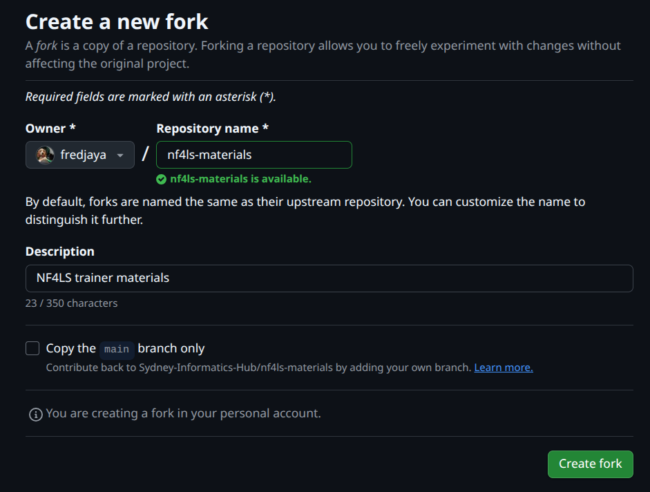
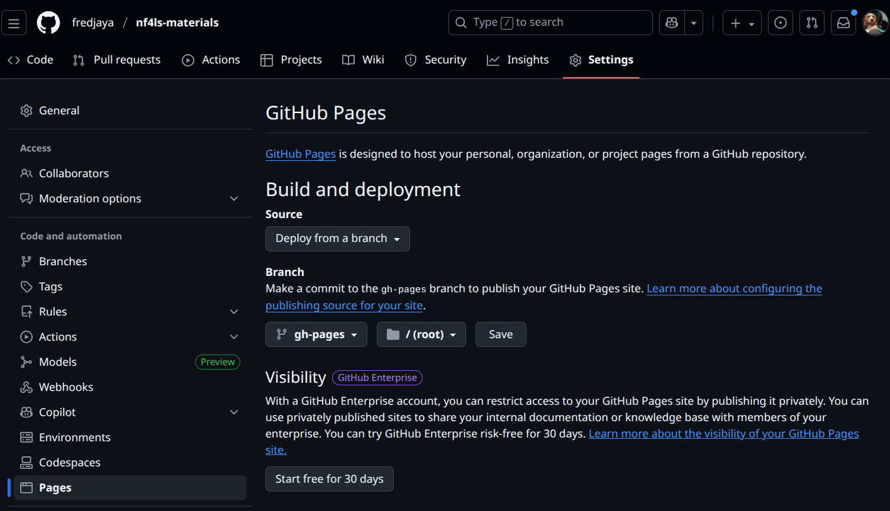

# Nextflow for the Life Sciences: Training materials

These materials support the training and onboarding of instructors to deliver a hands-on and practical introduction
into Nextflow foundations and application to a creating
a simple bioinformatics workflow.

This repo was developed as a [mirror](https://docs.github.com/en/repositories/creating-and-managing-repositories/duplicating-a-repository#mirroring-a-repository)
of the [Nextflow for the Life Sciences](https://github.com/Sydney-Informatics-Hub/hello-nextflow-2025) delivered in 2025.

This repo is inteded for **traianers and facilitators** to 
deliver their own workshops, including guidance on lesson structure, teaching notes, exercises, and delivery considerations.

## Audience

These materials are designed for:

- Trainers delivering Nextflow workshops
- Facilitators supporting hands-on training events
- Contributors developing or maintaining Nextflow training curricula

They assume familiarity with basic command-line usage and workflow concepts.

## Licence

These materials are licensed under the **Creative Commons Attribution 4.0
International (CC BY 4.0)** licence.

You are free to:
- **Share** - copy and redistribute the material in any medium or format
- **Adapt** - remix, transform, and build upon the material for any purpose

Under the following terms:
- **Attribution** - you must give [appropriate credit](https://creativecommons.org/licenses/by/4.0/#ref-appropriate-credit), provide a link to the licence,
  and [indicate if changes were made](https://creativecommons.org/licenses/by/4.0/#ref-indicate-changes). You may do so in any reasonable manner, but not in any way that suggests the licensor endorses you or your use.

See the [`LICENSE`](LICENSE) file for full licence text.

## Citation

If you use or adapt these materials, please cite them using the information in [`CITATION.cff`](CITATION.cff).

A DOI will be provided via Zenodo for released versions of this repository.

## Contributing

Contributions are welcome and encouraged, particularly those that improve:

- clarity in delivering key concepts
- lesson structure and flow
- trainer guidance and examples
- meeting of learning objectives

Please see [`CONTRIBUTING.md`](CONTRIBUTING.md) for contribution guidelines.

All contributors are expected to follow the
[`CODE_OF_CONDUCT.md`](CODE_OF_CONDUCT.md).

## Acknowledgements  

These materials were primarily developed by the Sydney Informatics Hub and Seqera, and is continued to be maintained by the Sydney Informatics Hub. Development and previous workshop delivery of the materials were enabled by the Australian BioCommons' BioCLI Platforms Project (NCRIS via Bioplatforms Australia).

Primary contributors to these training materials are listed in [`AUTHORS`](AUTHORS), with a full list of past workshop trainers, coordinators, facilitators and reviewers mentioned in the following:

- Hakkaart, C., Jaya, F., Samaha, G., & Al Bkhetan, Z. (2024). WORKSHOP: Hello Nextflow!. Zenodo. [https://doi.org/10.5281/zenodo.14532850](https://doi.org/10.5281/zenodo.14532850)
- Jaya, F., Geaghan, M., Xue, W., Antczak, M., Gauthier, M.-E., Beecroft, S., Raghunandan, P., Liyanage, K., Salamon, J., Roach, M., Gail, E., Hall, G., Lupat, R., Thanh, N., Urng, E., Hobbs, M., & O'Brien, M. (2025). WORKSHOP: Nextflow for the life sciences. Zenodo. [https://doi.org/10.5281/zenodo.16791039](https://doi.org/10.5281/zenodo.16791039)

---

## How to setup your own copy of the training materials

To prepare for your workshop delivery, you will create a separate fork of this repository. This is to ensure that you can freely change the materials to suit your delivery, and keep this repository as the "source" materials.

_Note: Under the CC BY 4.0 licence, you are free to share and and adapt the materials, with appropriate attribution._

**Creating a copy of the repository**

1. Fork this repo
2. **Deselect "copy `main` branch only**. This ensures that the `gh-pages` branch is included to render your materials.
3. Optionally, you can change the Owner to an organisation you are apart of.
4. Optionally, you may also rename the repository name
5. Select **Create fork**. This will create a copy in the Owner account you selected.

**Configuring your respository to publish on GitHub Pages**

1. In your forked repo, go to **Settings -> Pages**.
2. Under **GitHub Pages -> Build and deployment**, ensure the **Source** is **Deploy from a branch**.
3. Select **Branch** as **`gh-pages`** and **`/ root**.
4. Select **Save**.

5. Go to **Actions**.
6. Select **"I understand my workflows, go ahead and enable them"**.

After a few seconds, the content should be published on GitHub pages for the
account it was forked into:

`https://<github_account>.github.io/<repo_name>/`

In this example:

`https://fredjaya.github.io/nf4ls-materials/`
