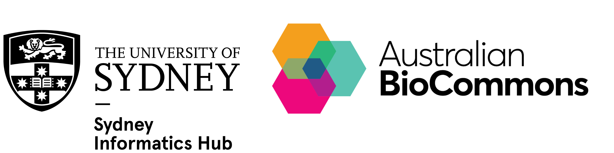

This training material includes ready-to-use materials and guidance for delivering a workshop on building reproducible and scalable scientific workflows with **Nextflow**.

Nextflow is a popular bioinformatics workflow orchestrator that supports portable, reproducible, and scalable analysis across different computational infrastructures. It enables the use of software containers, integration of tools written in different languages, and optimisation for varied data types and computing environments.

The content of these pages is designed to help other Trainers re-run and adapt the [‘Nextflow for the life sciences’ workshop](https://sydney-informatics-hub.github.io/hello-nextflow-2025/) for their own learners. 

It will help you to:

-   Explain the structure and purpose of the *Nextflow for the life sciences* workshop
-   Deliver the workshop using the provided materials
-   Support learners in building, running, and troubleshooting Nextflow workflows
-   Adapt the workshop to suit different audiences, formats, and computational environments
-   Evaluate and customise the materials for local training needs

 

-  :material-cog:{ .lg .middle } **Training logistics**

    ---

    [:octicons-arrow-right-24: Workshop structure, timings, and delivery considerations](instructor/logistics.md)

-   :fontawesome-solid-computer:{ .lg .middle } **Training environment**

    ---

    [:octicons-arrow-right-24: Software and files required for workshop delivery](instructor/environment.md)

-   :material-book:{ .lg .middle } **Training materials**

    ---

    [:octicons-arrow-right-24: Materials and teaching resources](instructor/materials.md)

 

This resource was developed by the Sydney Informatics Hub, University of Sydney and Australian BioCommons, enabled by Australian BioCommons' [BioCLI Platforms Project](https://www.biocommons.org.au/biocli). Funding was provided by NCRIS via [Bioplatforms Australia](https://bioplatforms.com/).

