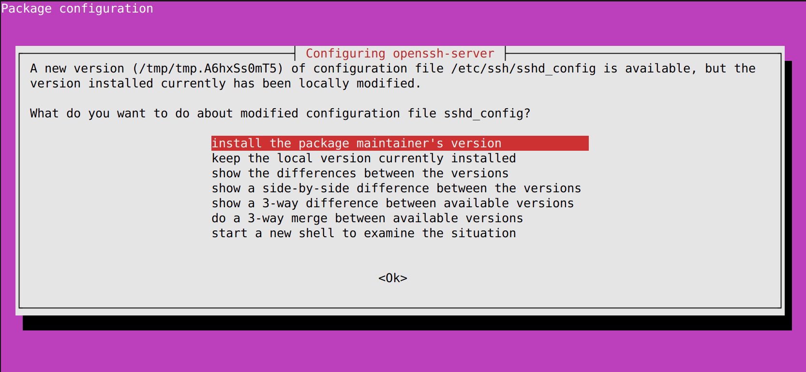

# NF4LS: Data and environment setup

This repo is a [mirror](https://docs.github.com/en/repositories/creating-and-managing-repositories/duplicating-a-repository#mirroring-a-repository)
of the [Nextflow for the Life Sciences](https://github.com/Sydney-Informatics-Hub/hello-nextflow-2025) workshop.

This repo is used to setup a new environment with all software, dependencies, folder structure, and input files for learners to run the workshop.

## Machine requirements

Install instructions are suitable for systems that meet the following:

- Ubuntu v24.04
- 2 cores
- 4 GB memory

Machines with more resources may be provisioned but we suggest 2 cores and 4 GB
memory as the minimum specifications **per user**. As a guide, the 2 cores
allows participants to run the Nextflow head job with one core, and tasks on
the other.

These instructions have been developed for Ubuntu v24.04. Older versions are not
recommended as they lack apt support for singularity.

## Software dependencies

- Java v21
- Nextflow v24.10.0
- Singularity (CE) v4.1.1

These versions are fixed to ensure reproducibility of the workshop content.

## Installation and setup

Each learner should have their own machine or user account to avoid
overwriting each others files and configurations.

We have provided an install script `install.sh` to setup a new user environment, in order:

1. Update and upgrade all `apt` packages on the machine
2. Install all dependencies, and their specific versions (java, nextflow, singularity)
3. Set up the correct folder structure and move files
4. Clean up the files generated in the test run, and from the setup repository

### How to setup a new environment

#### Initial setup

First, access the environement you need to set up and clone a copy of this
setup respository. This repository contains scripts to download all software
and files required to run the entire workshop.

```bash
cd $HOME && \
git clone https://github.com/Sydney-Informatics-Hub/nf4ls-data.git && \
cd nf4ls-data
```

Run the install script. This uses imported functions from `lib/*.sh` for
modularity:

```bash
./install.sh
```

If prompted with the following, select **"install the package maintainer's 
version"**



The installation will proceed once selected. At the end of the installation,
a test run of the complete Part 2 pipeline will be exectued. This will test
that all software and dependencies have been installed correctly, and all
files are in the correct location.

Once successful, you should see the following:


This indicates that the test run was successful, and that installation was
successful for this user. In this example, the default user is `ubuntu`.

#### Preparing for cloning

Once the install script has been run successfuly, there are a few more steps to
prepare the machine to be workshop-ready.

After the test run, you should see the following files and folders:

```console
ubuntu@ttt-fj-image-2:~$ tree -L 2 $HOME
/home/ubuntu
├── nf4ls-data
│   ├── install.sh
│   ├── lib
│   ├── part2
│   └── README.md
├── part1
├── part2
│   ├── bash_scripts
│   ├── dag-20251201-51128755.html
│   ├── data
│   ├── main.nf
│   ├── nextflow.config
│   ├── report-20251201-51128755.html
│   ├── results
│   ├── timeline-20251201-51128755.html
│   ├── trace-20251201-51128755.txt
│   └── work
└── singularity
    ├── quay.io-biocontainers-fastqc-0.12.1--hdfd78af_0.img
    ├── quay.io-biocontainers-multiqc-1.19--pyhdfd78af_0.img
    └── quay.io-biocontainers-salmon-1.10.1--h7e5ed60_0.img

11 directories, 11 files
```

Once you have validated that the installation is successful, the test run files
and the setup repository files are ready to be deleted:

```bash
cd ${HOME} && \
rm -fv ${HOME}/part2/*.html ${HOME}/part2/*.txt ${HOME}/part2/.nextflow.log* && \
rm -rfv ${HOME}/part2/.nextflow ${HOME}/part2/results ${HOME}/part2/work && \
rm -rfv ${HOME}/nf4ls-data
```

Lastly, ensure that the environmental variables (for example, `SINGULARITY_CACHEDIR`) is sourced correctly. This will be automatically be applied upon login.

```bash
source ${HOME}/.bashrc
```

#### The final file structure

After successfuly installation, and cleaning up the machines, the final file
structure should look as follows:

```bash
tree ${HOME}
```console
/home/ubuntu
├── part1 # Empty
├── part2
│   ├── bash_scripts
│   │   ├── 00_index.sh
│   │   ├── 01_fastqc.sh
│   │   ├── 02_quant.sh
│   │   └── 03_multiqc.sh
│   ├── data
│   │   ├── ggal
│   │   │   ├── gut_1.fq
│   │   │   ├── gut_2.fq
│   │   │   ├── liver_1.fq
│   │   │   ├── liver_2.fq
│   │   │   ├── lung_1.fq
│   │   │   ├── lung_2.fq
│   │   │   └── transcriptome.fa
│   │   ├── samplesheet.csv
│   │   └── samplesheet_full.csv
│   ├── main.nf
│   ├── .main.nf
│   └── .nextflow.config
└── singularity
    ├── quay.io-biocontainers-fastqc-0.12.1--hdfd78af_0.img
    ├── quay.io-biocontainers-multiqc-1.19--pyhdfd78af_0.img
    └── quay.io-biocontainers-salmon-1.10.1--h7e5ed60_0.img

7 directories, 18 files
```

**Part 1**

The `part1` folder is left intentionally empty as the learners will create scripts from scratch.

**Part 2**

The `part2` folder contains several files for the workshop:

- `bash_scripts/` includes example scripts of the pipeline that learners will
be implementing in Nextflow. These are never run, but serve as an example of
the key things that are required for transfer into Nextflow
- `data/ggal/` contains the reference `transcriptome.fa` that the paired-end
reads are mapped to during the `ALIGN` process. These are example data retrieved
from Seqera's [Simple RNA-Seq workflow training](https://training.nextflow.io/2.1.2/basic_training/rnaseq_pipeline/)
- `data/samplesheet*` are the input samplesheets used to load the paired `FASTQ` files into Nextflow
- `main.nf` is intentionally empty. Learners will build their RNA-seq workflow up from scratch in this file/
- `.main.nf` and `.nextflow.config` are example files of what the completed workflow by the end of the workshop will look like. Unused in the workshop, but learners may use this to copy code if required.

**Singularity images**

`singularity/` contains the pulled and correctly named images required for the Part 2 tools - `fastqc`, `multiqc`, and `salmon`.
